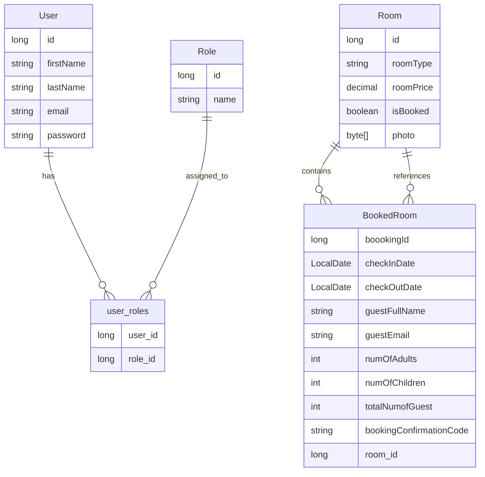

# 🏨 Hotel Management System

A full-stack Hotel Management web application built using **Spring Boot**, **ReactJS**, and **PostgreSQL**. It supports room browsing, booking, admin management, and user profile features with a secure and responsive UI.

---

## 📁 Project Structure

Since the frontend and backend are maintained in **separate repositories**, here is how the overall architecture is organized:

```bash
hotel-management-system-frontend/   → ReactJS client application
hotel-management-system-backend/    → Spring Boot REST APIs
```

---

## 🛠️ Tech Stack

| Layer      | Technologies                                 |
| ---------- | -------------------------------------------- |
| Frontend   | ReactJS, Axios, TailwindCSS/Bootstrap        |
| Backend    | Spring Boot, Spring Security, JPA, Hibernate |
| Database   | PostgreSQL (via Supabase)                    |
| Tools      | Maven, Postman, Git, GitHub, Docker          |
| Deployment | Render (Docker & Static Hosting), Supabase   |

---

## 🚀 Features

### 👤 User Features:

* User can register and login securely
* View all available rooms based on room type
* Check room availability for selected check-in and check-out dates
* Sort rooms by price: low to high / high to low
* Book a room and receive a confirmation email
* Forgot password functionality: OTP-based reset flow

### 🛠️ Admin Features:

* Admin can login with secure credentials
* Admin can add, update, and delete rooms
* Admin can view all room bookings
* Admin can manage all bookings and users

### 🔐 Common Features:

* JWT-based authentication and authorization
* Role-based access control (User / Admin)
* Responsive user interface (mobile-friendly)

---
## 🪰 Database Design

### 🔗 Entity Relationship Diagram (ERD)

> The following ERD reflects the real structure from your actual JPA entities.



---

## 🧪 Deployment Details

| Component | Platform        | Notes                          |
| --------- | --------------- | ------------------------------ |
| Backend   | Render (Docker) | Deployed as a Docker container |
| Frontend  | Render          | Served as a static React app   |
| Database  | Supabase        | Hosted PostgreSQL instance     |

### 🌍 Live URLs

```md
🔗 Frontend: [https://hotel-management-system-b7rh.onrender.com]
🔗 Backend: [https://hotel-management-system-1-80d1.onrender.com]
```

---

## 📊 Future Scope

* Integrate payment gateway (Razorpay/Stripe)
* Booking cancellation emails
* Admin analytics dashboard
* Add customer reviews and room ratings

---

## 👨‍💼 Author

* **Your Name** – [@Nishank-Kansara](https://github.com/Nishank-Kansara)
